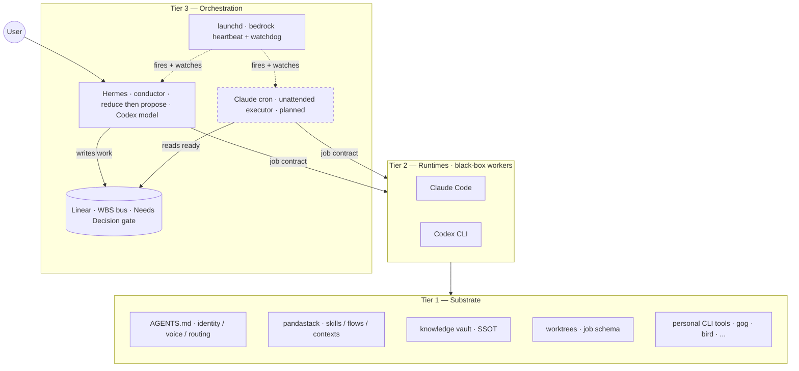

# pandastack

Personal context-aware AI operator OS — one substrate, three runtimes, no vendor lock-in.

I built pandastack to run my own work across multiple AI CLIs without dotdir sprawl. Skills are version-controlled markdown. Personas are replaceable. Context recipes ship as TOML. Same content runs across Claude Code, Codex CLI, and Hermes; per-CLI shims handle syntax differences. No data-layer vendor lock-in.

The stack is **26 skills** focused on dev, writing, and knowledge workflows, tiered into 24 core (markdown-only, fresh-clone runnable) and 2 ext (publicly installable CLI). Anchored on a personal Obsidian vault as SSOT.

**v2.2 philosophy**: pandastack ships verbs. The brain (gbrain or your own knowledge store) keeps state. Lifecycle discipline is your job, not the package's. v2.2 dropped the `flows/` directory (7 spec files) and tightened the manifest to 26 skills. The public package is self-contained: clone + install gives you everything in the manifest.

**Stability scope (read this first):**

v2 is **personal-substrate stable**: API, schema, and skill content are stable for the author's daily use. v2.2.0 (2026-05-09) is a scope-tightening release — 38 → 26 skills, 7 → 0 flows. Fresh-clone Core install runs without author hand-holding; verified-user-install count is still 0 because the v2.2 surface has not been validated by external A-class users yet.

What this means for you:

- If you are the author or a fork-and-learn power user, v2.2 is stable for daily use.
- If you are a fresh A-class user (Obsidian + Coding Agent power user willing to bring your own vault and CLIs), `bash scripts/bootstrap.sh` reports what runs now and what install steps remain. Core (24 skills) should run on a clean clone.
- If you use Logseq / Roam / Notion instead of Obsidian, skills will reference Panda's vault conventions (`Blog/_daily/`, `Inbox/ship-log/`, etc.) — these are prompt defaults, not hard-coded interfaces. You'd adapt them per session or by editing skill text. There's no built-in adapter layer; whether that matters depends on your tolerance for hand-tuning conventions.

**Who this is for:**
- **Multi-CLI users** who want the same skills across Claude Code, Codex CLI, and Hermes
- **Vault-centric operators** building on Obsidian
- **Personal-OS builders** who want substrate-first architecture instead of dotdir sprawl
- **v1 dogfood reality**: 1 user (the author). Verification window for v1.3.0+ structural fix opens now.

## Quick start

```bash
git clone https://github.com/panda850819/pandastack.git
cd pandastack
scripts/pandastack doctor          # detect runtimes and print next actions
bash scripts/bootstrap.sh --claude    # or --codex
```

`bootstrap.sh` reports:
- substrate state (`~/.agents/AGENTS.md` only)
- 24 core skills runnable on this clone with no external CLI
- 2 extension skills with the exact `brew install` / `npm install -g` to enable each

For programmatic use, `scripts/pandastack doctor --capabilities-json` emits a stable JSON capability map (schema in `plugins/pandastack/docs/capabilities.md`).

After install:

1. `/pandastack:init` once inside your project
2. `/office-hours` — bring a fuzzy idea, walk out with a written brief
3. `/sprint` — 1-2h focused execution, ends in SHIPPED / PAUSED / FAILED
4. `/ship knowledge <path>` on a finished note in your vault
5. Stop there. You'll know if pandastack fits how you work.

> **Tier model (v2.2)**: Skills are tiered in `plugins/pandastack/manifest.toml`. Core = markdown-only, runs on a fresh clone. Ext = needs a public CLI install. `capability-probe` only ABORTs when substrate is missing, not when ext CLIs are absent.

## Lifecycle map

> Which skill do I run when? This is the 30-second answer. pandastack v2.2 has 3 documented compositions; everything else is ad-hoc skill chaining you decide on.

```
                  pandastack lifecycles (v2.2)
                  ────────────────────────────

  dev        DEFINE ──▶ PLAN ──▶ GATE ──▶ BUILD ──▶ VERIFY ──▶ REVIEW ──▶ SHIP
             office-h   /plan   careful  build     qa         review     ship
             or grill                                          (codex
                                                              cross-check)

             Express path: /sprint chains DEFINE → SHIP internally (1-2h cap).

  writing    CAPTURE ──▶ STRUCTURE ──▶ DRAFT ──▶ SHIP
             direct      write          write     manual publish
                         (slop check)             (ship write retired 2026-06-12)

  knowledge  CAPTURE ──▶ DEDUP ──▶ DISTILL ──▶ VERIFY ──▶ SHIP
             direct      rg/grep   write       human       ship knowledge
             (or brain   knowledge/            readback    (decisions/ path
              ingest)                                       triggers decision-
                                                            note variant,
                                                            replaces v2.1
                                                            /work-ship)
```

Cross-flow router (start here when you're not sure which composition applies):

| If you're about to… | Open with | Composition |
|---|---|---|
| Build / fix / refactor code | `/office-hours` then `/sprint` | dev |
| Turn a draft into a published post | `/write` then manual publish | writing |
| Make a raw note durable | `/ship knowledge <path>` | knowledge |
| Close out a work topic / decision | `/ship knowledge <decisions/path>` | knowledge (decision-note variant) |
| End a session / week / month | `/checkpoint` · `/retro-week` · `/retro-month` | (independent skills, no flow) |

**Express path for dev work**: `/sprint` chains DEFINE → SHIP internally for 1-2h focused tasks. Use sprint when one skill should drive the whole arc; use the manual phase-by-phase progression when stages need user gates between them (e.g. `/careful` for prod) or when the work spans multiple sessions.

**What's NOT a flow** (cut in v2.2.0): `research` is a knowledge-flow variant (`/grill` then `/scout`-like recon then `/ship knowledge`); `work` is a dev-flow variant + decision-note variant of `/ship knowledge`; `decision` is the cron-autonomy contract ("cron proposes, Panda decides, Panda executes") which lives as a rule in `~/.agents/AGENTS.md`, not as a flow; `retro` is a cadence served by `/retro-week` and `/retro-month` skills directly. None of these earn a separate spec.

## How skills connect

`/office-hours` writes a brief. `/sprint` reads the brief and executes. `/sprint` ends in SHIPPED, then `/ship knowledge <path>` reads the session note and runs Close + Extract + Backflow. Each step writes an artifact the next step picks up. You decide when to fire each step; the brief, session note, and decision log are the contracts between phases.

## See it work

```
You:    我想做一個 RSS curation 工具，每天整理 AI 圈新聞，但範圍我沒想清楚
You:    /office-hours

Claude: [load context] rg "RSS\|digest\|curation" knowledge/ — 3 條相關 vault note 帶上來
        [grill] 6 forcing questions: 痛是「資訊過載」還是「漏掉重要的」?
                                     現在怎麼讀? 「重要」誰定義?

You:    痛是漏掉，「重要」標準是會引用到工作上
Claude: [premise challenge] 你說「整理 digest」，但描述的是「curation 系統」.
                            Digest 是 push; curation 是反向過濾.
        [alternatives]
                A. RSS → AI 摘要 → 每日 push
                B. RSS → 看過的舊文 fingerprint → 過濾不相關
                C. RSS → AI ranking → top-N 推送
        [recommendation] 先做 B 的 MVP. A 你已經被 newsletter 餵爆.
        [write brief] docs/briefs/2026-05-05-feed-curator.md

You:    /sprint docs/briefs/2026-05-05-feed-curator.md
Claude: [dojo] 讀 brief, scan 過往 RSS / curation note (rg / find)
        [grill-lite] 一題: MVP 先做哪 3 個 source?
You:    HN + Lenny + 自己 X 收藏
Claude: [execute] ~400 lines across 4 files. bun test 12/12 passed.
        [review] /review → 1 ASK (fingerprint hash 衝突) → 你 approve fix.
        [terminal] State: SHIPPED. Session note: docs/sessions/2026-05-05-sprint-feed-curator.md

You:    /ship knowledge docs/sessions/2026-05-05-sprint-feed-curator.md
Claude: [Close]    frontmatter / used_in / wiki-link 補齊
        [Extract]  3 questions:
                   - 最大發現? 「fingerprint 比 keyword 過濾乾淨」
                   - 假設錯在? 「以為 30 條都該讀，其實 5 條夠了」
                   - 下次重來怎麼做? 「先寫 fingerprint test 再寫 source connector」
        [Backflow]
                   principle → docs/learnings/patterns/fingerprint-over-keyword.md
                   SOP → curate-feeds skill 已合併
                   signal → 加進 weekly retro 候選
```

You said "RSS digest tool". The agent reframed it as "curation system" — listening to the pain, not the feature request. Three slash commands, end to end. Brief is the contract between phases.

## Architecture

pandastack is three tiers: a runtime-agnostic substrate, interchangeable runtimes, and an orchestration layer that drives them as black-box workers — never merging their internal loops.

The **Tier 1 substrate** is runtime-agnostic: identity, voice, skill content, knowledge vault, worktrees, and the job schema live on disk. All runtimes read the same `AGENTS.md` before acting. No vendor lock-in at the data layer.

The **Tier 2 runtimes** (Claude Code, Codex CLI) are thin, interchangeable consumers of Tier 1. Each gets a slim shim in its dotdir (`~/.claude/`, `~/.codex/`); skills, flows, and context recipes are identical across runtimes, with a per-CLI tool-name mapping for syntax. The orchestrator runs each as a black-box worker behind a job contract (job dir + prompt + output + diff + verifier) — shared substrate, not shared behavior.

The **Tier 3 orchestration** is two layers split by reliability, not feature:

- **launchd** is the bedrock heartbeat — dumb, OS-level, zero-token, reboot-surviving. It fires the deterministic jobs and the watchdog that checks everything above it. The watchdog has to live here: one that depends on the system it watches can't catch a silent wedge.
- **Hermes** is the conductor — the judgment and conversation a heartbeat can't carry. It reads a personal Linear workspace as the work-breakdown store, reduces it to "today's most urgent" (`pandastack-linear-reduce`), proposes over Telegram, and advances tickets (`pandastack-linear-advance`), with `Needs Decision` as a hard, machine-enforced human gate. Hermes inherits the Codex model. The unattended executor that polls a ready ticket and dispatches a worker is a separate Claude cron (planned), isolated so its failure never takes the conductor down.

Linear is the bus: the conductor writes work in, the executor reads ready work out. Every layer shares the same Tier 1 substrate — no duplication, no drift.



## Multi-runtime arbitrage

Claude Code (Opus) handles foreground reasoning. Codex CLI takes multi-file edits and batch tasks, spending OpenAI subscription quota instead of Claude tokens. The conductor picks a runtime per job — a deep-reasoning seam vs a mechanical batch — and dispatches it through the job contract against the same Tier 1 substrate.

## Runtime support

pandastack is not a monolithic runtime. It is a stack package: shared skills, flows, personas, context recipes, and conventions that different hosts can consume.

Host design notes live in [`docs/ADDING_A_HOST.md`](docs/ADDING_A_HOST.md).

| Host | Status | Install model |
|---|---|---|
| Claude Code | First-class | Claude plugin marketplace, local repo or GitHub repo |
| Codex CLI | Supported | Native skill discovery via clone + symlink |
| Hermes | Supported as conductor / host, not as first-class packaged runtime yet | Import/symlink selected skills into `~/.hermes/skills/` |
| OpenClaw | Planned / experimental | Intended shape is a skill package, not shipped as a first-class installer in this repo yet |

## Install

`scripts/bootstrap.sh` is the entrypoint. It probes substrate, lists what's ready, prints exact commands for what's missing, then prints the host-specific install line.

```bash
git clone https://github.com/panda850819/pandastack.git
cd pandastack
bash scripts/bootstrap.sh             # report only
bash scripts/bootstrap.sh --claude    # also print Claude Code install steps
bash scripts/bootstrap.sh --codex     # also print Codex CLI install steps
```

### Per-host one-liners (after clone)

| Host | Install |
|---|---|
| Claude Code | `/plugin marketplace add /absolute/path/to/pandastack` then `/plugin install pandastack@pandastack` then `/reload-plugins` |
| Codex CLI | `ln -sfn /absolute/path/to/pandastack/plugins/pandastack/skills ~/.codex/skills/pandastack` then restart Codex |
| Hermes | Import/symlink selected skills into `~/.hermes/skills/` (see `docs/HERMES.md`) |
| OpenClaw | Skill package experimental, see `docs/OPENCLAW.md` |

After install, run `/pandastack:init` once inside your project.

### Substrate config

`~/.agents/AGENTS.md` is the only required substrate. No env vars needed as of v2.0.1:

- **Vault path**: skills run from vault root (`cd <your-vault> && /<skill>`). Cron entries `cd` first.
- **Plugin path**: resolved via host plugin-resolver (Claude Code / Codex SDK) or relative path from the calling skill.
- **Work-vault decision-note close**: `cd <work-vault> && /ship knowledge decisions/<file>.md` — runs the decision-note variant which also writes `Inbox/ship-proposals/` for manual external push (replaces v2.1 `/work-ship`).

Re-run `bash scripts/bootstrap.sh` any time to verify substrate.

## Local development loop, author workflow

If you are developing pandastack itself, the clean loop is:

1. Clone the repo locally.
2. Point Claude Code marketplace at that local repo.
3. Install `pandastack@pandastack` from the local source.
4. Edit files in the repo.
5. Run `/reload-plugins` in Claude Code to pick up changes.
6. Re-run the target skill / flow.

Example:

```
/plugin marketplace add /absolute/path/to/pandastack
/plugin install pandastack@pandastack
/reload-plugins
```

For Codex, the equivalent loop is `git pull` or local edits on the cloned repo plus a Codex restart. For Hermes direct-import setups, re-copy or re-symlink the changed skill files.

## Contexts

Context recipes live in `plugins/pandastack/contexts/*.toml`. Each recipe binds a flow, persona, skill subset, and memory namespace to a specific identity.

| Context | Purpose |
|---|---|
| `personal:developer` | Personal dev work — eng persona, dev + knowledge flows |
| `personal:writer` | Personal writing — writing + knowledge flows |
| `personal:knowledge-manager` | Vault maintenance, wiki lint, knowledge lifecycle |
| `personal:trader` | Market research, on-chain analysis, trading flows |

## Skills

26 skills grouped by lifecycle (24 core / 2 ext — see `plugins/pandastack/manifest.toml`). Persona names follow the gstack convention — each skill is "your specialist" for that step.

### Think / intake

| Skill | Your specialist | What they do |
|---|---|---|
| `/office-hours` | The Interrogator | Bring a fuzzy idea, walk out with a written brief. 5-stage flow: load context, adversarial grill, premise challenge, alternatives, write brief. |
| `/grill` | The Adversary | Atomic 5-10 min adversarial discovery. One question at a time, hunting for hidden requirements and unknown unknowns. |
| `/dojo` | The Sensei | Pre-action context prep. Scan past similar cases via rg / find on session notes, surface gotchas before the work session starts. |

### Plan / decide

| Skill | Your specialist | What they do |
|---|---|---|
| `/boardroom` | The Boardroom | 4-voice plan critique (CEO → product → design → eng). Per-finding apply gate. |
| `/ceo` | Strategic Advisor | Multi-framework thinking. Kill / pivot / continue judgment. |
| `/product-lead` | VP Product | User problems over solutions. Says no more than yes. |
| `/ops-lead` | COO | Systems that run without you. Process design when there's real pain. |

### Build

| Skill | Your specialist | What they do |
|---|---|---|
| `/sprint` | Sprint Coach | 1-2h single-track focused execution. Internal flow: dojo → grill (lite) → execute → review → ship. For multi-step work, run multiple sprints in sequence. |
| `/team-orchestrate` | The Conductor | N independent branches in parallel git worktrees. Use only when branches are truly independent. |
| `/eng-lead` | Staff Engineer | Build, debug, ship. Minimal diff, root cause, no spiral. Also covers tech-stack / DB schema / API contract decisions. |
| `/design-lead` | Senior Designer | Intentional over decorative. Anti-slop, accessibility-first. |
| `/careful` | Safety Gate | Confirmation gates before destructive commands (force push, rm -rf, DROP). |
| `/freeze` | Scope Freezer | Lock edits to specific paths for the session. |

### Review / QA

| Skill | Your specialist | What they do |
|---|---|---|
| `/review` | Code Reviewer | Parallel 3-pass review (correctness, security, architecture) + Codex adversarial cross-check. |
| `/qa` | QA Lead | Browser-based QA. Opens real pages, runs flows, finds bugs. |

### Ship (multi-mode)

| Skill | Your specialist | What they do |
|---|---|---|
| `/ship` | Release Engineer | Multi-mode close. `/ship` (no args) = test + commit + push + PR. `/ship knowledge <path>` = Close + Extract + Backflow on a knowledge note (decision-note variant when path matches `decisions/`, replaces v2.1 `/work-ship`). |
| `/handover` | Codex Handover | Hand UNFINISHED work to Codex to DO (ship closes, handover delegates). `/handover [slug]` = sync, Claude spawns `codex exec` now + collects the result. `/handover --async [slug]` = write a payload to `docs/handoffs/` for Hermes / offline. Codex runs on ChatGPT-subscription quota, conserving the Claude session. |

### Trust

| Skill | Your specialist | What they do |
|---|---|---|
| `/gatekeeper` | The Gatekeeper | Pre-adoption trust check (skills, MCPs, repos, on-chain addresses). |

### Reflect / cadence

| Skill | Your specialist | What they do |
|---|---|---|
| `/retro-week` | Weekly Retro | Three-phase weekly retro. Phase 1 scans `Blog/_daily/` + `Inbox/ship-log/` directly via rg / find. |
| `/retro-month` | Monthly Retro | Strategic monthly review with project memory updates. |

Vault hygiene (orphans / stale / superseded) is a direct `rg` / `find` scan or — when `gbrain` is connected — a brain query (`mcp__gbrain__find_orphans`). v2.2.0 cut `/inbox-triage`.

### Session

| Skill | Your specialist | What they do |
|---|---|---|
| `/init` | The Initializer | One-time pandastack init per project. Detects project type, writes config to CLAUDE.md. |
| `/checkpoint` | The Bookmarker | Save / resume working state snapshots. |

`/done` was cut (session close folded into `/checkpoint` + brain session pages; skill deleted in PR #5).

### Writing

| Skill | Your specialist | What they do |
|---|---|---|
| `/write` | The Editor | Voice-aware drafting + slop detection. Used inside the writing composition. |

### Tool wrappers (public CLI)

| Skill | Wraps |
|---|---|
| `/deepwiki` | DeepWiki repo docs + Mermaid diagrams |

`/agent-browser` was archived 2026-06-08 — the npm `agent-browser` CLI carries its own docs; `/qa` still uses the CLI directly.

`summarize`, `notion`, `slack`, `scout`, `inbox-triage`, `work-ship`, `think-like-*` were cut in v2.2.0 — see `RESOLVER.md` § "v2.2.0 cut summary".

## Personas

5 persona skills under `plugins/pandastack/skills/{ceo,eng-lead,ops-lead,product-lead,design-lead}/`, sharing the frame in `lib/persona-frame.md`. pandastack is skill-only — no separate agent dispatch layer. Edit any persona SKILL.md; the change picks up after `/reload-plugins`.

| Persona skill | Role |
|---|---|
| `eng-lead` | Staff engineer — build, review, debug, ship |
| `design-lead` | Senior designer — UI/UX, accessibility, anti-slop |
| `ceo` | Strategic advisor — scope decisions, kill/pivot |
| `ops-lead` | COO — systems that run without you, process design |
| `product-lead` | VP Product — requirements, scope, metrics |

## Lifecycle compositions

v2.2.0 cut the `flows/` directory. There are no longer separate flow spec files — what used to live in `plugins/pandastack/flows/*.md` is now either:

1. **Inline in the relevant skill**: `/sprint` for dev, `/ship knowledge` (incl. decision-note variant) for knowledge close.
2. **Documented in the "Lifecycle map" section above**: the 3 first-class compositions (dev / writing / knowledge).
3. **Demoted because it wasn't really a flow**:
   - `research` → knowledge variant (Phase 1-3 vary, Phase 4-6 = knowledge ship)
   - `work` → dev variant + decision-note variant of `/ship knowledge`
   - `decision` → autonomy contract ("cron proposes, Panda decides, Panda executes") in `~/.agents/AGENTS.md`
   - `retro` → cadence served by `/retro-week` and `/retro-month` directly

This shrinks the documentation surface and makes "which skill do I run" answerable in 30 seconds from the Lifecycle map alone.

## Cron jobs

The public package ships no cron-driven skills. If you want scheduled cadence, wire your own skills with whichever Tier 3 orchestration mechanism you prefer (launchd plist, system crontab, or Hermes).

## Updating

### For users

#### Claude Code, installed from GitHub marketplace source

```bash
/plugin marketplace update pandastack
/plugin update pandastack@pandastack
/reload-plugins
```

#### Claude Code, installed from local repo

Pull the repo or edit it locally, then reload:

```bash
cd /absolute/path/to/pandastack
git pull
```

Then run `/reload-plugins` in Claude Code.

#### Codex CLI

```bash
cd ~/.codex/pandastack
git pull
```

Restart Codex. The symlinked skills update with the repo.

#### Hermes

Re-copy or re-symlink the changed skill folders into `~/.hermes/skills/`.

### For the author / maintainer

Recommended release loop:

1. Update skill / flow / context content in the repo.
2. Update user-facing docs, especially `README.md` and install notes.
3. Bump visible version markers when behavior changed:
   - `CHANGELOG.md`
   - `plugins/pandastack/.claude-plugin/plugin.json`
   - `plugins/pandastack/.codex-plugin/plugin.json`
   - `.claude-plugin/marketplace.json`, if marketplace metadata changed
4. Verify in the real hosts you claim to support:
   - Claude Code local marketplace install
   - Codex clone + symlink install
   - Hermes import/symlink path, if relevant to the change
5. Push the branch, open a PR, merge, then tell users which update path to run.

## Contributing

### Before opening a PR

- Keep skill content in `plugins/pandastack/skills/<name>/SKILL.md`
- Keep each skill concise; the current discipline is roughly under 80 lines unless the extra length clearly earns itself
- Run validation:

```bash
bash scripts/lint-manifest-sync.sh
```

Frontmatter fields `reads`, `writes`, `domain`, and `classification` are optional. They were originally specified for an L5 firewall hook; the public pandastack surface treats them as advisory audit metadata, not an enforced boundary. The firewall is **4 enforced + 1 advisory**: L1–L4 enforced, L5 (these per-skill fields) advisory on the public surface. High-blast Bash commands are hard-blocked separately by `plugins/pandastack/hooks/pretooluse-destructive-guard.sh`. See [SKILL-FRONTMATTER.md](SKILL-FRONTMATTER.md) and [docs/firewall-l5.md](docs/firewall-l5.md) for the schema.

### How to open a PR

1. Fork the repo or create a branch from `main`.
2. Make the smallest coherent change.
3. Update docs if install surface, runtime behavior, or invocation changes.
4. Add or update CHANGELOG entries when the change is user-visible.
5. Open a PR describing:
   - what changed
   - which host it affects, Claude Code / Codex / Hermes / OpenClaw
   - how you tested it
   - any migration or reload step users need

Repository PRs: [github.com/panda850819/pandastack/pulls](https://github.com/panda850819/pandastack/pulls)

### How to file an issue

Please include:
- host/runtime, Claude Code / Codex / Hermes / OpenClaw
- install model, GitHub marketplace / local marketplace / clone + symlink / manual import
- expected behavior
- actual behavior
- reproduction steps
- relevant logs or screenshots

Repository issues: [github.com/panda850819/pandastack/issues](https://github.com/panda850819/pandastack/issues)

## License

MIT

## Acknowledgements

README structure (Quick start, Who this is for, See it work, Skill / specialist / what they do tables) inspired by [gstack](https://github.com/garrytan/gstack). The JSONL session timeline pattern is also borrowed from gstack and iterated for per-context isolation.
