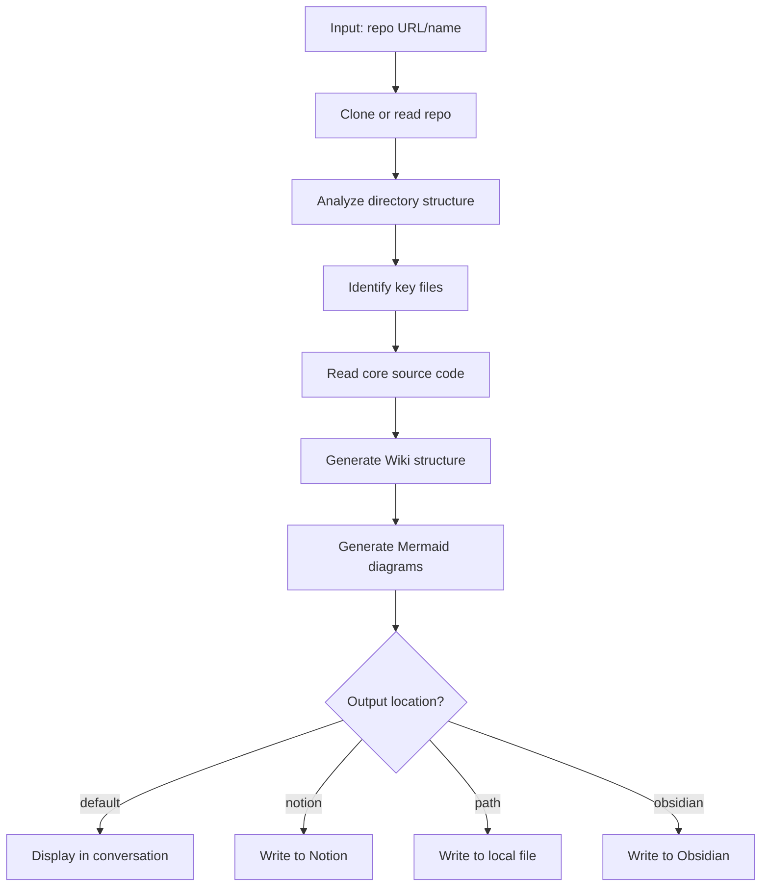

# DeepWiki Skill

Analyze GitHub repos and generate structured documentation with Mermaid architecture diagrams.

## Syntax

```
/deepwiki <repo-url-or-name> [--output <location>]
```

## Parameters

| Parameter | Description | Example |
|-----------|-------------|---------|
| `repo` | GitHub repo URL or `org/name` format | `<org>/<repo>` |
| `--output` | Output location (optional) | `notion`, `obsidian`, `./path` |

## Examples

```bash
/deepwiki <org>/<repo>                      # display in conversation
/deepwiki <org>/<repo> --output notion      # routing per the Output Routing Rule below
```

---

## Workflow



---

## Phase 1: Repo Analysis

### 1.1 Clone Repository

```bash
# Verify GitHub account — abort early if not authenticated
gh auth status || { echo "ERROR: gh not authenticated. Run 'gh auth login' first."; exit 1; }

# Clone to temp directory (shallow clone to minimize download)
REPO_DIR="/tmp/deepwiki/<repo-name>"
if [ -d "$REPO_DIR" ]; then
  cd "$REPO_DIR" && git pull
else
  gh repo clone <repo> "$REPO_DIR" -- --depth 1
fi

# If clone fails (repo doesn't exist, private, network error):
# → Report the error clearly to the user and stop
# → Do NOT attempt to generate documentation without source code
```

### 1.2 Analyze Directory Structure

```bash
# Exclude common non-source directories
tree -L 3 -I 'node_modules|.git|dist|build|coverage|__pycache__|.next|target'
```

### 1.3 Identify Tech Stack

| File | Tech Stack |
|------|------------|
| `package.json` | Node.js/TypeScript |
| `Cargo.toml` | Rust |
| `requirements.txt` / `pyproject.toml` | Python |
| `hardhat.config.js` / `hardhat.config.ts` | Solidity + Hardhat |
| `foundry.toml` | Solidity + Foundry |
| `Move.toml` | Move |
| `go.mod` | Go |

**Fallback**: If no recognized config file exists, infer tech stack from file extensions (`.py`, `.rs`, `.go`, `.ts`, `.sol`) and directory conventions. State "inferred from file extensions" in the output.

### 1.4 Identify Key Files

Priority reading order:
1. `README.md` - Existing documentation
2. `package.json` / `Cargo.toml` etc. - Dependencies and scripts
3. `src/index.ts` / `src/lib.rs` / `src/main.py` - Entry points
4. `contracts/*.sol` - Smart contracts
5. `test/` - Test files (understand functionality)

### 1.5 Handle Minimal or Empty Repos

After reading key files, assess whether there is enough source code to generate meaningful documentation:

- **No source files at all** (only README, LICENSE, config): Inform the user that the repo has no analyzable source code. Output a minimal report with just the README summary, repo metadata, and a note that no architecture or module docs could be generated.
- **Very small repo** (< 5 source files): Produce documentation but skip the "Core Modules" section if there aren't distinct modules. Focus on file-by-file description instead.
- **Monorepo with many packages**: Identify the top-level packages first (`packages/`, `apps/`, `crates/`). Always generate a high-level overview with per-package summaries first. Then ask the user if they want a deep dive into a specific package. Do not block on user input — deliver the overview immediately.

**Do NOT hallucinate modules, APIs, or architecture for repos that lack sufficient source code.**

---

## Phase 2: Documentation Generation

### Mandatory Output Requirements

Every deepwiki output MUST include ALL of the following sections. Missing any section is a failure.

| # | Section | Requirement | Fail if missing |
|---|---------|-------------|-----------------|
| 1 | **Tech Stack** | List framework, language, key dependencies from config files | Yes |
| 2 | **Architecture Diagram** | At least one syntactically valid Mermaid `graph` diagram showing module/component relationships. Validate: unique node IDs, correct arrow syntax (`-->`, `-->\|label\|`), no unclosed brackets. | Yes |
| 3 | **Directory Structure** | Table with `\| Directory \| Purpose \|` columns, derived from actual `tree` output — never invented | Yes |
| 4 | **Core Modules** | Each module references concrete functions/classes/APIs found in source code | Yes |
| 5 | **Quick Start** | Install + run commands matching the project's actual package manager and scripts from config files | Yes |

### Source Reading Rule

You MUST read at least 2 actual source files (entry points like `src/index.ts`, `src/lib.rs`, `src/main.py`, `contracts/*.sol`, `app/page.tsx`, etc.) — not just README and config files. Module descriptions and architecture diagrams must be grounded in source code you actually read, not inferred from file names alone.

### Output Routing Rule

When `--output` is specified, you MUST route the final document accordingly:
- `--output notion` → write via `notion page update` (ask user for page ID first)
- `--output obsidian` → write to `knowledge/repos/<repo-name>.md`
- `--output <path>` → write to the exact path specified
- (no flag) → display directly in conversation

Never ignore the `--output` flag. Never default to conversation display when a flag is present.

### Output Structure

Fill-in template (the 5 mandatory sections + Related Resources): see `skills/engineering/deepwiki/lib/output-and-diagrams.md`.

---

## Phase 3: Mermaid Generation

**Source-grounding guard (hard rule)**: A wired diagram with directional edges between modules (`A --> B`, `A -->|calls| B`) asserts relationships. Those edges MUST be grounded in source you actually read (imports/calls), never inferred from file names or READMEs. If you have NOT read/verified the source (per the Phase 2 Source Reading Rule), do NOT draw any wired diagram with directional edges. A caveat is not enough — caveating a fabricated structure still asserts unverified relationships. In that case, allowed options are: (a) prose-only description of the components, or (b) an explicit "insufficient source to diagram architecture" note in place of the diagram.

**A directory tree, file listing, or set of folder/file names is NOT source** — it grounds edges no more than a clone failure does. If all you have is names/structure (no actually-read import/call statements), you are in the unread case: no edged diagram, caveated or not, and no second "likely flow" / "canonical pipeline order" block that smuggles the same arrows back in. Inferring `ingest --> transform --> sink` from folder names is exactly the forbidden move.

**Self-check (code gate, not honor system):** after writing any doc with a mermaid/flow diagram, run `lib/lint-mermaid-grounding.sh <output-file>`. Exit 2 = directional edges without a source citation, or a canonical/likely-layout block smuggling edges back in. On fail, replace the edged diagram with an edgeless inventory or an "insufficient source" note and re-run until exit 0. Two prose re-fixes leaked here; the lint is the backstop.

Generate appropriate diagrams based on project type (module relationship for all projects, contract relationship for Solidity, sequence/data-flow for complex pipelines). Syntax templates per type: `skills/engineering/deepwiki/lib/output-and-diagrams.md`.

---

## Phase 4: Output

Route per the **Output Routing Rule** (Phase 2). Notion is the only target needing a command — ask for the page ID, write the doc to `/tmp/deepwiki/output.md`, then `notion page update <page-id> --file /tmp/deepwiki/output.md`. Default / `<path>` / obsidian use the Write tool to the resolved path.

---

## Phase 5: Quality Gate (mandatory before output)

Write the doc to `/tmp/deepwiki/output.md` first, then run the checks below against that file. A check passes only when its command exits clean or its grep finds the evidence — producing the checklist is not passing it. Fix and re-run until all pass before delivery.

1. **Source grounding** (code gate): `lib/lint-mermaid-grounding.sh /tmp/deepwiki/output.md`. Exit 0 required. On exit 2, replace edged diagrams with an edgeless inventory or "insufficient source" note and re-run (per Phase 3).
2. **Mermaid syntax** (code gate when available): for each diagram block, `echo "$DIAGRAM" | npx -y @mermaid-js/mermaid-cli mmdc -i - -o /dev/null`. Must exit 0 (renders). If `mmdc` is unavailable, fall back to re-reading each block for unique node IDs and correct arrows (`-->`, `-->|label|`, `->>+`), no unclosed brackets.
3. **Directory accuracy** (cross-check): every row in the Directory Structure table must appear in the captured `tree` output (Phase 1.2). `comm` / grep the table dirs against the tree; no row without a tree match.
4. **Source-backed modules**: each Core Module must name a concrete function/class/API that is greppable in a source file you read (Source Reading Rule). Drop any module you cannot grep.
5. **Quick Start executable**: install/run commands must match the package manager and script names actually declared in the config file (e.g. `scripts` in `package.json`, `[tasks]` in config). No invented commands.

Checks 1-3 are falsifiable by command. Checks 4-5 are falsifiable by grep against read source — cite the file, do not self-report. This gate enforces the Mandatory Output Requirements and Source Reading Rule (Phase 2); it does not restate them.

---

## Integrations

- **GitHub CLI** (`gh`): Clone repos
- **Notion CLI** (`notion`): Write to Notion
- **Write tool**: Write to local/Obsidian

## Verification

Beyond the Phase 5 gate:
1. Output links (README, docs) point to valid URLs
2. Cleanup: `rm -rf /tmp/deepwiki/<repo-name>` after output is delivered

## Handoff

After completion, inform user of:
- Generated documentation location
- How to view/edit
- Follow-up suggestions (if needed)
