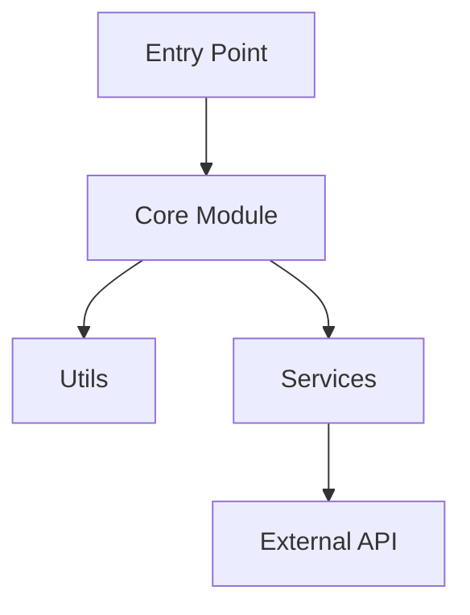
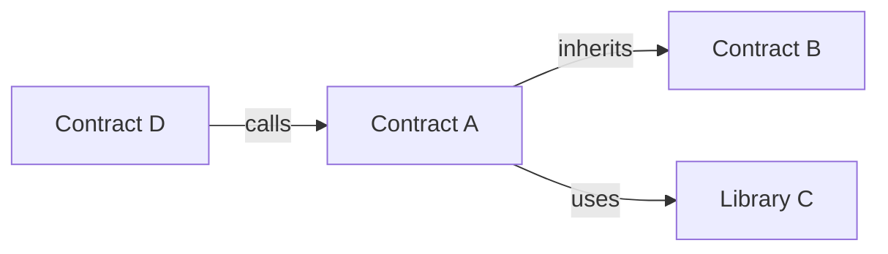
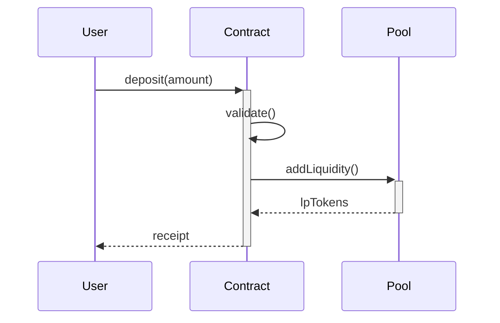
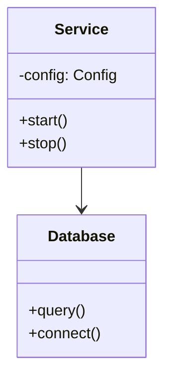
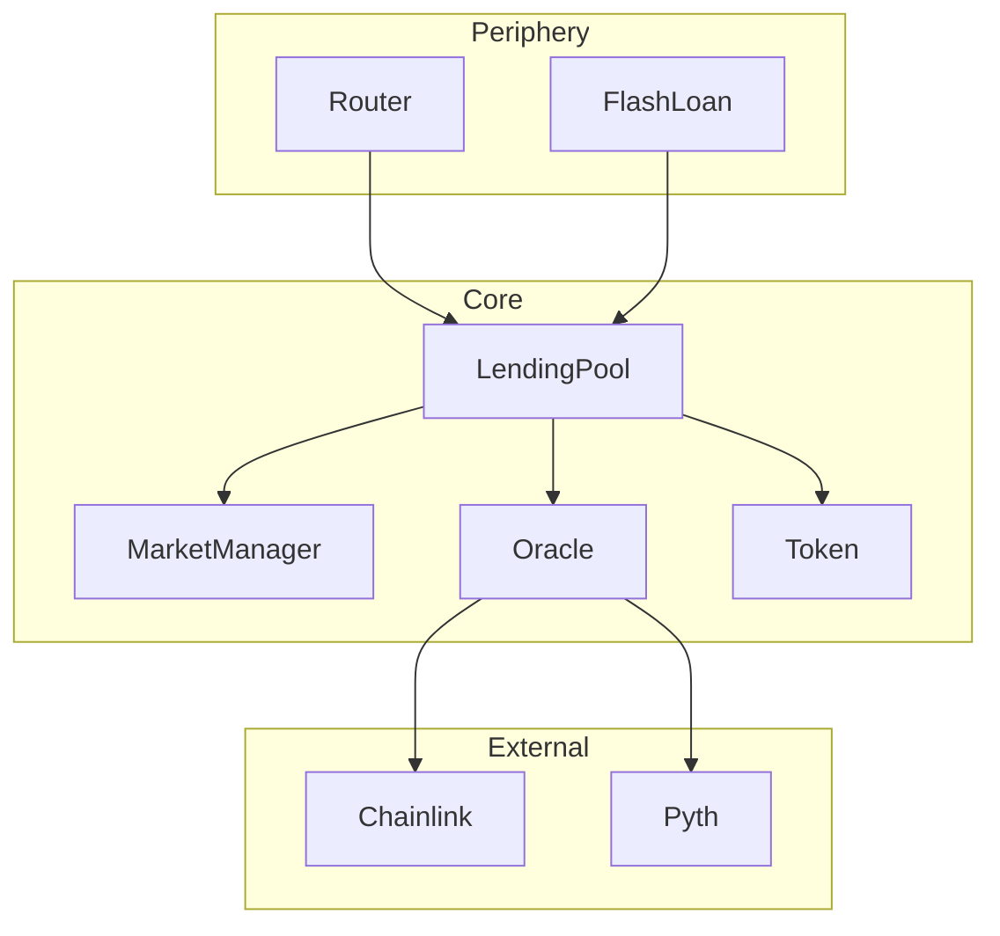
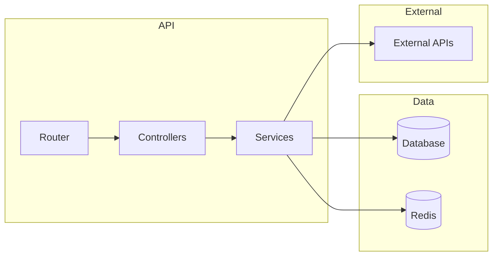

# Mermaid Diagram Generation Prompt

根據以下程式碼結構，生成 Mermaid 圖表。

## 輸入資訊

- **專案類型**: {{project_type}}
- **模組列表**: {{modules}}
- **依賴關係**: {{dependencies}}

## 圖表類型選擇

### 1. 模組關係圖（所有專案必須）

使用 `graph TD`（top-down）或 `graph LR`（left-right）。

**規則**:
- 節點用 `[名稱]` 表示模組
- 箭頭 `-->` 表示依賴
- 可用 `-->|label|` 標註關係類型

### 2. 智能合約關係圖（Solidity 專案）

**關係類型**:
- `inherits` - 繼承
- `uses` - 使用 library
- `calls` - 外部調用
- `implements` - 實作 interface

### 3. 資料流圖（複雜流程）

**語法**:
- `->>` 同步調用
- `-->>` 返回
- `+/-` 表示 activation

### 4. 類別圖（OOP 專案）

## 輸出要求

1. **選擇最適合的圖表類型**
   - 一般專案：模組關係圖
   - Solidity：合約關係圖 + 資料流（如有複雜操作）
   - OOP 重度專案：類別圖

2. **保持簡潔**
   - 最多 10-15 個節點
   - 聚焦核心模組
   - 省略工具類（utils）細節

3. **語法正確**
   - 確保可渲染
   - 避免特殊字元（用引號包裹）
   - 節點 ID 用簡短英文

## 範例輸出

### DeFi Lending Protocol

### API Service

