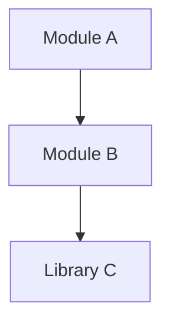
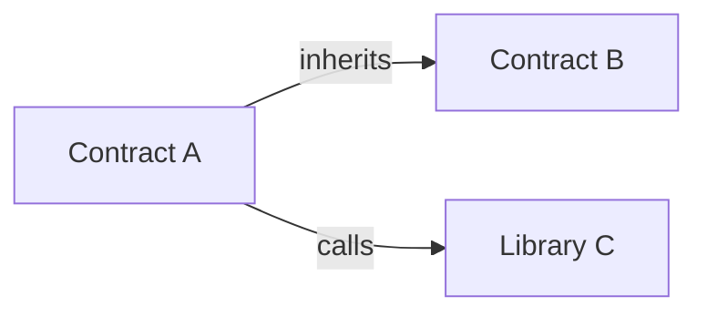
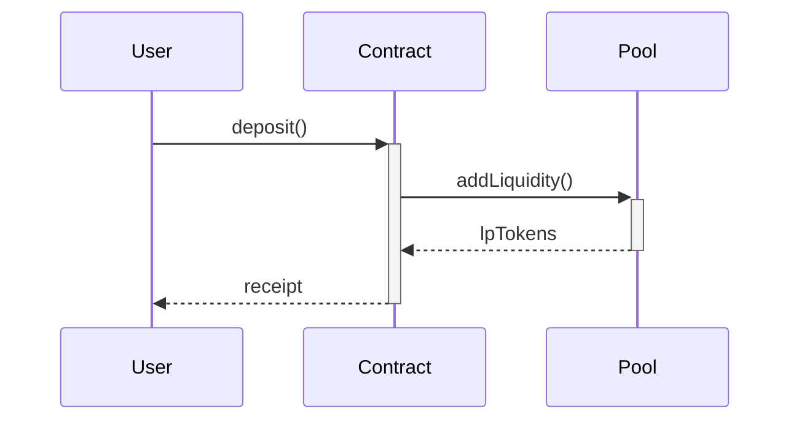

# DeepWiki output template + Mermaid examples

Reference material for the deepwiki SKILL. The hot body owns the rules (Mandatory
Output Requirements, Source Reading Rule, the source-grounding hard rule); this file
holds the fill-in template and the per-project-type diagram examples.

## Output structure

```markdown
# <Repo Name>

> One-line description

## Tech Stack

- Framework: ...
- Language: ...
- Dependencies: ...

## Architecture Diagram


## Directory Structure

| Directory | Purpose |
|-----------|---------|
| src/ | ... |
| test/ | ... |

## Core Modules

### Module A
- Functionality: ...
- Key APIs: ...

### Module B
- ...

## Quick Start

```bash
# Install
pnpm install

# Run
pnpm dev
```

## Related Resources

- [Original README](...)
- [Notion Docs](...)
```

## Diagram examples by project type

Each edge below must trace to an import/call you actually read (per the Source
Reading Rule). These are syntax templates, not pre-approved structures.

### Module Relationship Diagram (all projects)



### Smart Contract Relationship Diagram (Solidity projects)



### Data Flow Diagram (if applicable)


